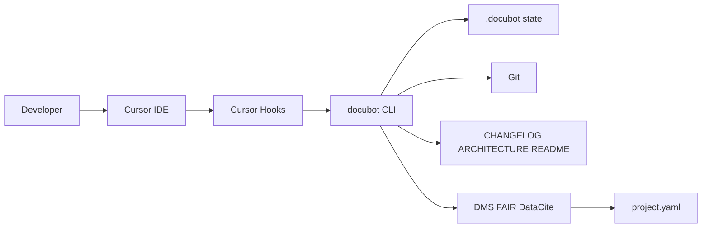

# Architecture

<!-- docubot:managed -->

## Overview

Docubot is a portable documentation agent that keeps project docs aligned with git history and coding sessions. It runs via Cursor hooks (primary) and optional git hooks (secondary), using a Python CLI for deterministic updates and optional LLM enrichment.

## Context

## Components

| Component | Responsibility | Paths |
|-----------|----------------|-------|
| core | _auto-tracked_ | `src/docubot/**` |
| hooks | _auto-tracked_ | `.cursor/hooks/**, .githooks/**` |
| docs | _auto-tracked_ | `docs/**, templates/**, *.md` |
| data | _auto-tracked_ | `data/**, notebooks/**, metadata/**` |

## Compliance Layer

Docubot supports NIH Data Management and Sharing ([NOT-OD-21-014](https://grants.nih.gov/grants/guide/notice-files/NOT-OD-21-014.html)) and [FAIR](https://www.go-fair.org/fair-principles/) alignment:

| Module | Output |
|--------|--------|
| `metadata/project.py` | Load `.docubot/metadata/project.yaml` |
| `metadata/nih_dms.py` | `docs/DATA_MANAGEMENT_AND_SHARING.md` (six DMS elements) |
| `metadata/fair.py` | `docs/FAIR_CHECKLIST.md` with scored checkboxes |
| `metadata/datacite.py` | `metadata/datacite.json` (DataCite kernel-4 JSON) |
| `metadata/citation.py` | `CITATION.cff` (CFF 1.2.0 software citation) |
| `metadata/schema.py` | JSON Schema validation for `project.yaml` |
| `metadata/validate.py` | `docubot validate --compliance` |

Human-edited metadata in `project.yaml` is merged with git-detected file patterns on each sync. `CITATION.cff` and DataCite JSON are regenerated from `project.yaml` on sync (edit metadata there, not the generated files). Genomic Data Sharing (GDS) supplements are out of scope for v0.1.

## Data Flow

1. **workspaceOpen** — scaffold missing docs, load manifest.
2. **sessionStart** — create ephemeral session under `.docubot/sessions/`.
3. **afterFileEdit** — queue touched files (fast, no LLM).
4. **sessionEnd / stop** — sync changelog, architecture, README, DMS, FAIR, DataCite; archive session to manifest.
5. **post-commit** (optional) — append changelog entry from commit message.

## Key Decisions

- Deterministic updates by default; LLM is opt-in via config and environment variables.
- HTML comment blocks protect hand-edited README sections outside managed regions.
- Idempotent finalize via `conversation_id:generation_id:reason` keys in manifest.
- Session files are gitignored; manifest metadata is committed.

## Dependencies

- Python 3.11+
- Git
- PyYAML, Click
- Cursor (for lifecycle hooks; git hooks work elsewhere)

## Session Activity

<!-- docubot:session-activity -->
- **2026-05-19 17:26 UTC** — session `fc67abe4` on branch `cursor/docubot-agent-72b2`: 13 file(s), 0 commit(s), components: core, hooks, docs.
<!-- /docubot:session-activity -->
